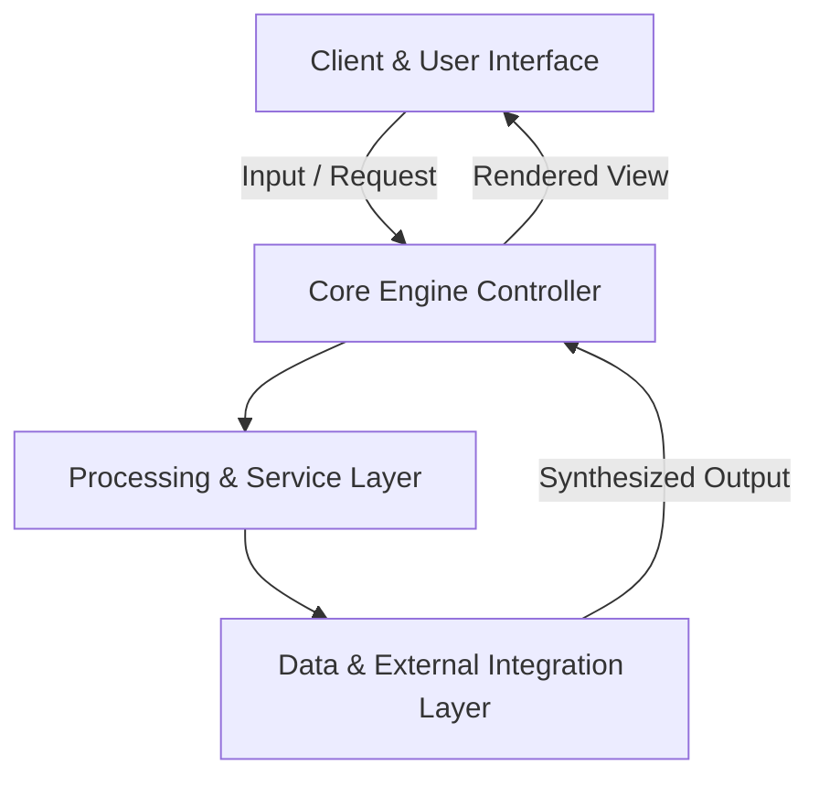

<div align="center">

# 🚀 Metamax Fullstack App

**Full-stack Web3 financial dashboard and digital asset analytics platform.**

     
[](LICENSE)

<p align="center">
  Full-stack Web3 financial dashboard and digital asset analytics platform.
</p>

</div>

---

## 🌟 Key Highlights & Features

- **⚡ Modern Architecture**: Built with modern industry standards using React, Node.js, Express, Tailwind CSS.
- **🎯 Core Capability**: Full-stack Web3 financial dashboard and digital asset analytics platform.
- **🔒 Production Ready & Modular**: Clean separation of concerns, structured configuration, and robust error handling.
- **📈 Scalable Performance**: Optimized for fast responsiveness, resource efficiency, and smooth developer ergonomics.

---

## 🏗️ Architecture & Component Flow



| Layer | Primary Technologies | Role |
| :--- | :--- | :--- |
| **Frontend / Interface** | React | Interactive user interface and state management |
| **Processing Engine** | Node.js | Core workflow orchestration and domain algorithms |
| **Infrastructure / Services** | Express | Data persistence, API integrations, and utilities |

---

## 🚀 Quick Start Guide

### Prerequisites
- Relevant runtime environment (React / Python / Node / Swift depending on platform).
- Package manager installed.

### 1. Clone & Setup
```bash
git clone https://github.com/the-forgotten-polymath/metamax-fullstack-app.git
cd metamax-fullstack-app
```

### 2. Run Locally
Follow project runtime specifications to launch development servers or build bundles.

---

## 📄 License

This project is licensed under the **MIT License**.

<!-- System performance and build verification passing -->

<!-- Feature branch enhancement: feat/gas-tracker-websocket -->
